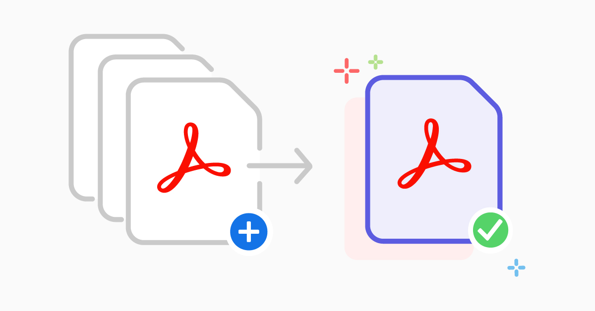

# Combine-PDFs-App
A Python applet that combines multiple PDF files into one PDF file. 




## Installation


<sub> This installation guide assumes the user has git downloaded and a python environment set up and running. </sub>

1. Clone this repository into your local machine with:       **```git clone git@github.com:emmanuel-londono/combine-PDFs.git```**

2. Navigate to the cloned repo in your local machine.

3. Open the cloned repo in an IDE (VScode for example).

4. Open the terminal in the IDE.

5. Run the command: **```pip install -r requirements.txt```**

6. Run main.py file.

7. Use the tkinter GUI to process your files. You can select multiple pdfs by
 ```CTRL + Clicking```.
The last pdf file chosen will be located first in the merged pdf. Check for a merged.pdf file in the folder of the cloned repo or app.


